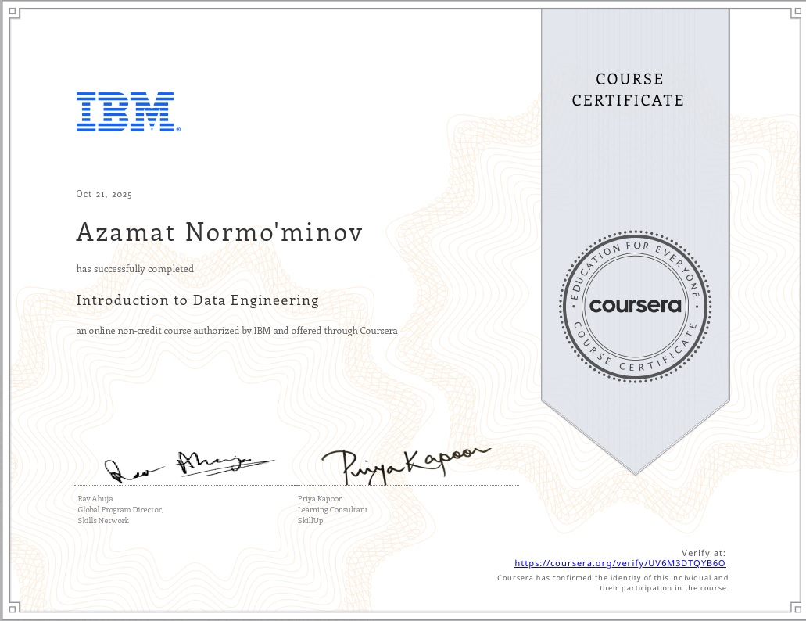

# ibm-data-engineering
IBM Introduction to Data Engineering Certificate Project
# IBM Introduction to Data Engineering

**Azamat Normo'minov**  
**Certificate Date:** October 21, 2025  
**Platform:** Coursera (IBM)  
**Skills:** Python, SQL, ETL, Data Pipelines

---

## Certificate

**[View Certificate (JPG)](certificate.jpg)** | **[Download PDF](Coursera UV6M3DTQYB6O.pdf)**

**[Verify on Coursera](https://coursera.org/verify/UV6M3DTQYB6O)**

---

## Dataset
- **Source:** [Kaggle – Brazilian E-commerce](https://kaggle.com/datasets/olistbr/brazilian-ecommerce)  
- **Original:** `olist_orders_dataset.csv` (99K+ rows)  
- **Sample:** 1000 rows

---

## ETL Pipeline
1. **Extract** → CSV from Kaggle  
2. **Transform** →  
   - `order_status` → UPPER CASE  
   - `order_purchase_timestamp` → datetime  
3. **Load** → `cleaned_orders.csv`

---

## Files
- [Notebook](simple_data_cleaner.ipynb)  
- [Original Data](olist_orders_dataset.csv)  
- [Cleaned Data](cleaned_orders.csv)

---

## Course Progress

| Module | Status | Details |
|--------|--------|-------|
| **Module 1** | **Completed** | Python Basics |
| **Module 2** | **Completed** | Python Data Structures (Tuples, Lists, Dictionaries) |
| **Module 3** | **In Progress** | Python Programming Fundamentals |

**Goal: IBM Apprenticeship – March 2026**

---

**Contact:**  
[LinkedIn]([https://linkedin.com/in/azamatnorm](https://www.linkedin.com/in/%D0%B0%D0%B7%D0%B0%D0%BC%D0%B0%D1%82-%D0%BD%D0%BE%D1%80%D0%BC%D1%83%D0%BC%D0%B8%D0%BD%D0%BE%D0%B2-260a92238/)) | [Email](a.normuminov1985@gmail.com)
